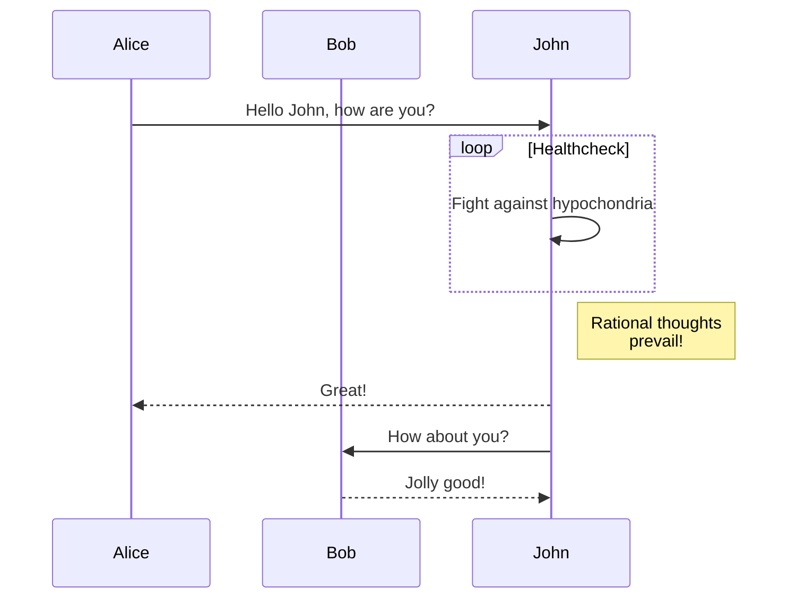
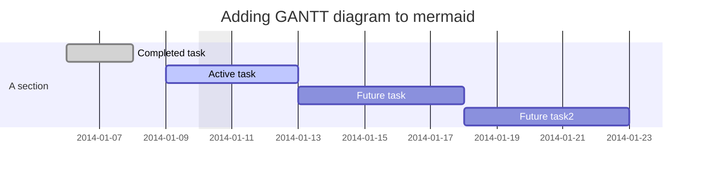
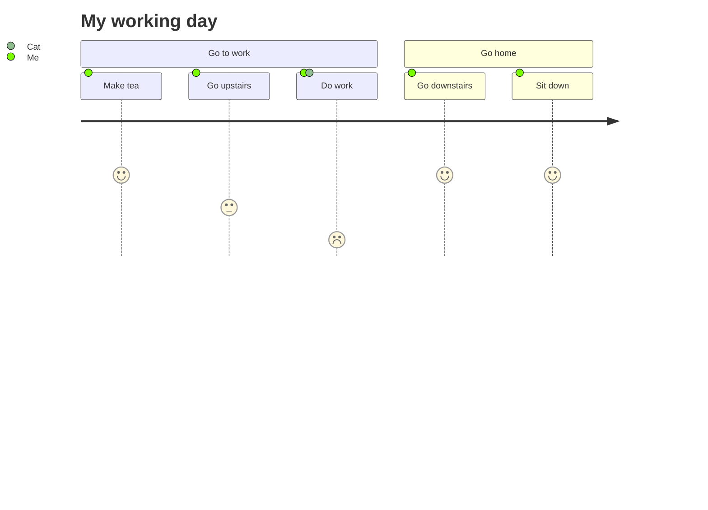
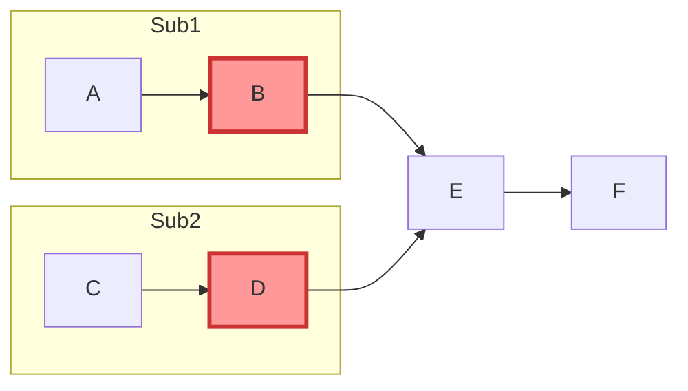
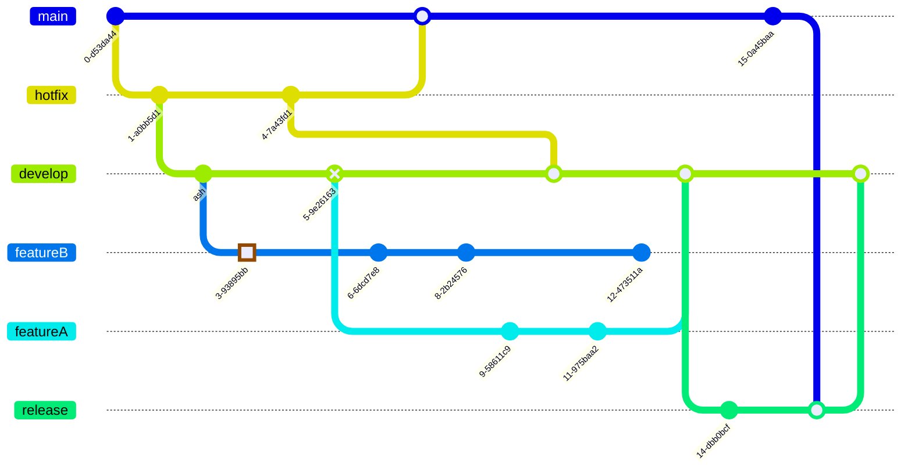

# test mermaid

## test flowchart

```mermaid
graph TD;
    A-->B;
    A-->C;
    B-->D;
    C-->D;
```

## test Sequence diagram

```mermaid
sequenceDiagram
    participant Alice
    participant Bob
    Alice->>John: Hello John, how are you?
    loop Healthcheck
        John->>John: Fight against hypochondria
    end
    Note right of John: Rational thoughts <br/>prevail!
    John-->>Alice: Great!
    John->>Bob: How about you?
    Bob-->>John: Jolly good!
```

## test gantt

just test gannt

```mermaid
gantt
dateFormat  YYYY-MM-DD
title Adding GANTT diagram to mermaid
excludes weekdays 2014-01-10

section A section
Completed task            :done,    des1, 2014-01-06,2014-01-08
Active task               :active,  des2, 2014-01-09, 3d
Future task               :         des3, after des2, 5d
Future task2               :         des4, after des3, 5d
```

## test journey

```mermaid
journey
    title My working day
    section Go to work
      Make tea: 5: Me
      Go upstairs: 3: Me
      Do work: 1: Me, Cat
    section Go home
      Go downstairs: 5: Me
      Sit down: 5: Me

```

## test class

```mermaid
flowchart LR

subgraph Sub1
    A --> B
end

subgraph Sub2
    C --> D
end

B & D --> E --> F

classDef Colored stroke-width:3px,fill:#F99,stroke:#C33
class B,D Colored
```

## test Gitgraph

```mermaid
gitGraph:
commit
branch hotfix
checkout hotfix
commit
branch develop
checkout develop
commit id:"ash"
branch featureB
checkout featureB
commit type:HIGHLIGHT
checkout main
checkout hotfix
commit type:NORMAL
checkout develop
commit type:REVERSE
checkout featureB
commit
checkout main
merge hotfix
checkout featureB
commit
checkout develop
branch featureA
commit
checkout develop
merge hotfix
checkout featureA
commit
checkout featureB
commit
checkout develop
merge featureA
branch release
checkout release
commit
checkout main
commit
checkout release
merge main
checkout develop
merge release
```
